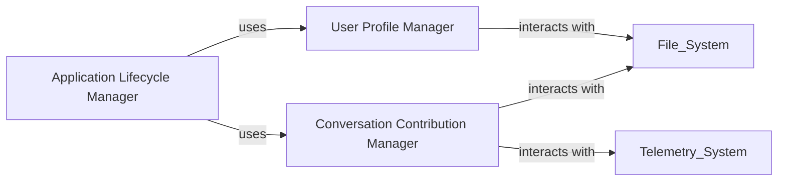

## Component Details

Application Management subsystem

### User Profile Manager

This component is dedicated to managing user profiles, which store configuration settings, preferences, and other user-specific data. It provides functionalities to retrieve, apply, reset, and migrate user profiles, ensuring that the interpreter operates according to the user's personalized settings and maintains state across sessions.

**Related Classes/Methods**:

- <a href="https://github.com/OpenInterpreter/open-interpreter/blob/master/interpreter/terminal_interface/profiles/profiles.py#L1-L1" target="_blank" rel="noopener noreferrer">`interpreter.terminal_interface.profiles.profiles` (1:1)</a>

### Conversation Contribution Manager

This component is responsible for managing the collection, storage, and submission of user conversation data. It handles the logic for retrieving past conversations, prompting the user for contribution consent, and writing conversation data to a cache. Its primary purpose is to facilitate the improvement of the interpreter by allowing users to share their interaction data for telemetry and model enhancement.

**Related Classes/Methods**:

- <a href="https://github.com/OpenInterpreter/open-interpreter/blob/master/interpreter/terminal_interface/contributing_conversations.py#L1-L1" target="_blank" rel="noopener noreferrer">`interpreter.terminal_interface.contributing_conversations` (1:1)</a>

### Application Lifecycle Manager

This component orchestrates the overall startup and shutdown of the application's terminal interface. It handles initial setup tasks such as parsing command-line arguments, validating LLM settings, and coordinating with other core components like the User Profile Manager and Conversation Contribution Manager to initialize the application environment.

**Related Classes/Methods**:

- <a href="https://github.com/OpenInterpreter/open-interpreter/blob/master/interpreter/terminal_interface/start_terminal_interface.py#L18-L577" target="_blank" rel="noopener noreferrer">`interpreter.terminal_interface.start_terminal_interface` (18:577)</a>

### [FAQ](https://github.com/CodeBoarding/GeneratedOnBoardings/tree/main?tab=readme-ov-file#faq)