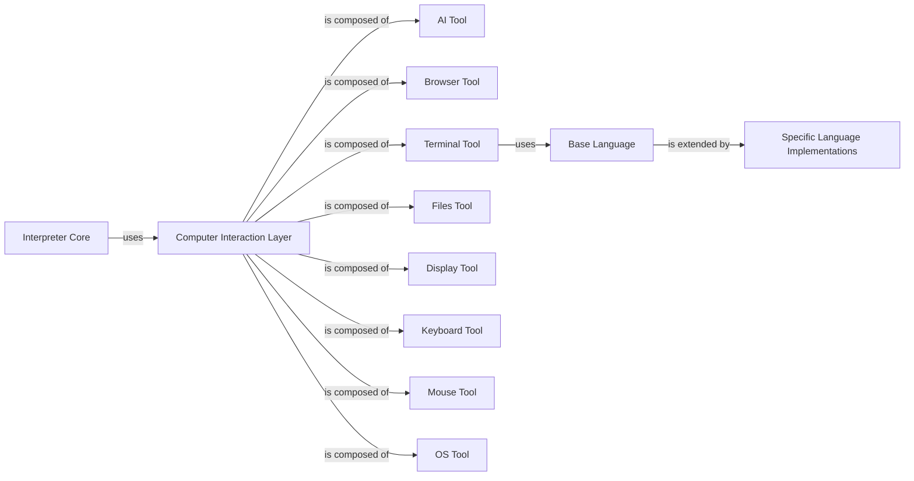

## Component Details

The Computer Interaction Layer is a critical subsystem within the project, designed to provide the Interpreter Core with a unified and high-level programmatic interface for interacting with the underlying computer system. It achieves this by aggregating and managing various specialized computer tools, thereby abstracting the complexities of direct system interaction. This design is fundamental as it isolates the core logic of the interpreter from the specifics of operating system interactions, enhancing portability, maintainability, and extensibility.

### Computer Interaction Layer

The primary component that acts as a central hub, providing a unified, high-level programmatic interface for the Interpreter Core to interact with the underlying computer system. It aggregates and manages various specialized computer tools, abstracting the complexities of direct system interaction (e.g., file system, browser, display, AI capabilities).

**Related Classes/Methods**:

- `Computer Interaction Layer` (1:1)

### AI Tool

Provides an interface for the interpreter to interact with AI capabilities, such as image recognition or natural language processing.

**Related Classes/Methods**:

- `AI Tool` (1:1)

### Browser Tool

Enables the interpreter to programmatically control and interact with a web browser for tasks like navigation, data extraction, or web application automation.

**Related Classes/Methods**:

- `Browser Tool` (1:1)

### Terminal Tool

Provides an interface for executing commands in the system terminal and capturing their output, supporting various programming languages.

**Related Classes/Methods**:

- `Terminal Tool` (1:1)

### Files Tool

Manages file system operations, including reading, writing, creating, and deleting files and directories.

**Related Classes/Methods**:

- `Files Tool` (1:1)

### Display Tool

Manages interactions with the computer's display, potentially for screen capture, display settings, or rendering information.

**Related Classes/Methods**:

- `Display Tool` (1:1)

### Keyboard Tool

Enables programmatic control of the keyboard for simulating key presses and input.

**Related Classes/Methods**:

- `Keyboard Tool` (1:1)

### Mouse Tool

Enables programmatic control of the mouse for simulating movements and clicks.

**Related Classes/Methods**:

- `Mouse Tool` (1:1)

### OS Tool

Provides an interface for interacting with the operating system, offering functionalities like system information retrieval, process management, and environment variable access.

**Related Classes/Methods**:

- `OS Tool` (1:1)

### Base Language

An abstract base class that defines the common interface and functionalities for all specific language implementations used by the Terminal Tool. This includes methods for executing code and handling output.

**Related Classes/Methods**:

- `Base Language` (1:1)

### Interpreter Core

The core logic of the interpreter that uses the Computer Interaction Layer.

**Related Classes/Methods**: _None_

### Specific Language Implementations

Various specific language implementations (e.g., Python, JavaScript, Shell) that extend the Base Language.

**Related Classes/Methods**: _None_

### [FAQ](https://github.com/CodeBoarding/GeneratedOnBoardings/tree/main?tab=readme-ov-file#faq)