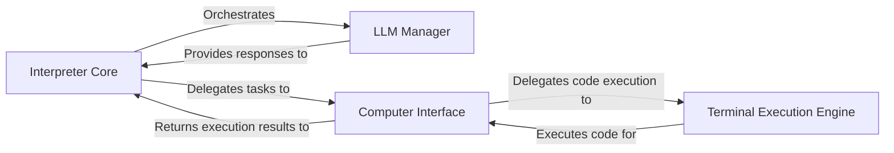

## Component Details

The `Interpreter Core` subsystem is the brain of the application, orchestrating the entire conversation flow, interacting with the Language Model (LLM), and managing computer-related tasks. It is designed with a clear separation of concerns, allowing for modularity and extensibility.

### Interpreter Core

This is the central processing unit of the application. It manages the overall conversation flow, interprets messages, decides on actions (LLM interaction or computer tasks), and orchestrates the execution of these actions. It also handles asynchronous operations and provides an API server for external interaction, acting as the primary coordinator.

**Related Classes/Methods**:

- <a href="https://github.com/OpenInterpreter/open-interpreter/blob/master/interpreter/core/core.py#L1-L1" target="_blank" rel="noopener noreferrer">`interpreter.core.core.OpenInterpreter` (1:1)</a>

- <a href="https://github.com/OpenInterpreter/open-interpreter/blob/master/interpreter/core/async_core.py#L43-L275" target="_blank" rel="noopener noreferrer">`interpreter.core.async_core.AsyncInterpreter` (43:275)</a>

- <a href="https://github.com/OpenInterpreter/open-interpreter/blob/master/interpreter/core/async_core.py#L950-L1018" target="_blank" rel="noopener noreferrer">`interpreter.core.async_core.Server` (950:1018)</a>

### LLM Manager

This component is solely responsible for all communication with the Language Model. It handles sending prompts, receiving responses, and abstracting away the complexities of different LLM providers and their specific APIs (e.g., function calling, text generation). It ensures the `Interpreter Core` remains agnostic to the underlying LLM implementation.

**Related Classes/Methods**:

- <a href="https://github.com/OpenInterpreter/open-interpreter/blob/master/interpreter/core/llm/llm.py#L37-L412" target="_blank" rel="noopener noreferrer">`interpreter.core.llm.llm.Llm` (37:412)</a>

### Computer Interface

This component provides the LLM with the ability to interact with the computer's operating system and various applications. It acts as a unified interface for diverse computer functionalities, exposing a set of "tools" or "skills" that the LLM can call. It abstracts the complexities of system-level operations, such as file system access, browser control, or terminal commands.

**Related Classes/Methods**:

- <a href="https://github.com/OpenInterpreter/open-interpreter/blob/master/interpreter/core/computer/computer.py#L21-L236" target="_blank" rel="noopener noreferrer">`interpreter.core.computer.computer.Computer` (21:236)</a>

### Terminal Execution Engine

This component, a specialized part of the `Computer Interface`, is responsible for executing code in various programming languages (e.g., Python, JavaScript, Shell) within the terminal environment. It manages the lifecycle of language processes, handles input/output, and provides the actual execution environment for code generated by the LLM.

**Related Classes/Methods**:

- <a href="https://github.com/OpenInterpreter/open-interpreter/blob/master/interpreter/core/computer/terminal/terminal.py#L32-L206" target="_blank" rel="noopener noreferrer">`interpreter.core.computer.terminal.terminal.Terminal` (32:206)</a>

- <a href="https://github.com/OpenInterpreter/open-interpreter/blob/master/interpreter/core/computer/terminal/languages/subprocess_language.py#L11-L192" target="_blank" rel="noopener noreferrer">`interpreter.core.computer.terminal.languages.subprocess_language.SubprocessLanguage` (11:192)</a>

- <a href="https://github.com/OpenInterpreter/open-interpreter/blob/master/interpreter/core/computer/terminal/languages/python.py#L10-L12" target="_blank" rel="noopener noreferrer">`interpreter.core.computer.terminal.languages.python.Python` (10:12)</a>

- <a href="https://github.com/OpenInterpreter/open-interpreter/blob/master/interpreter/core/computer/terminal/languages/shell.py#L7-L35" target="_blank" rel="noopener noreferrer">`interpreter.core.computer.terminal.languages.shell.Shell` (7:35)</a>

- <a href="https://github.com/OpenInterpreter/open-interpreter/blob/master/interpreter/core/computer/terminal/languages/javascript.py#L5-L34" target="_blank" rel="noopener noreferrer">`interpreter.core.computer.terminal.languages.javascript.JavaScript` (5:34)</a>

- <a href="https://github.com/OpenInterpreter/open-interpreter/blob/master/interpreter/core/computer/terminal/languages/jupyter_language.py#L1-L1" target="_blank" rel="noopener noreferrer">`interpreter.core.computer.terminal.languages.jupyter_language.JupyterLanguage` (1:1)</a>

### [FAQ](https://github.com/CodeBoarding/GeneratedOnBoardings/tree/main?tab=readme-ov-file#faq)