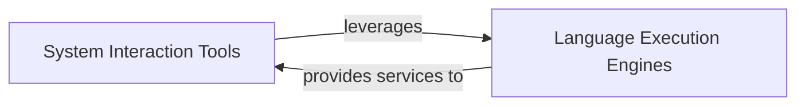

## Component Details

This component is a critical part of the interpreter's ability to interact with the host operating system and execute code in various programming languages. It is composed of two fundamental sub-components: `System Interaction Tools` and `Language Execution Engines`.

### System Interaction Tools

This component provides high-level, abstract interfaces for the interpreter to interact with the underlying computer system. It encapsulates functionalities such as executing shell commands, performing file system operations (like editing), and general computer control. These tools act as a crucial bridge, translating the interpreter's high-level directives into concrete, low-level system actions.

**Related Classes/Methods**:

- `BashTool` (1:1)

- `ComputerTool` (1:1)

- `EditTool` (1:1)

- `BaseAnthropicTool` (1:1)

- `ToolResult` (1:1)

- `CLIResult` (1:1)

- `ToolFailure` (1:1)

### Language Execution Engines

This component is responsible for managing the execution of code in various programming and scripting languages within the terminal environment. It provides a standardized and extensible framework for running code, capturing its output, and handling different language-specific execution paradigms (e.g., direct subprocess execution, Jupyter kernel interactions).

**Related Classes/Methods**:

- <a href="https://github.com/OpenInterpreter/open-interpreter/blob/master/interpreter/core/computer/terminal/base_language.py#L1-L1" target="_blank" rel="noopener noreferrer">`BaseLanguage` (1:1)</a>

- <a href="https://github.com/OpenInterpreter/open-interpreter/blob/master/interpreter/core/computer/terminal/languages/subprocess_language.py#L11-L192" target="_blank" rel="noopener noreferrer">`SubprocessLanguage` (11:192)</a>

- <a href="https://github.com/OpenInterpreter/open-interpreter/blob/master/interpreter/core/computer/terminal/languages/jupyter_language.py#L1-L1" target="_blank" rel="noopener noreferrer">`JupyterLanguage` (1:1)</a>

- <a href="https://github.com/OpenInterpreter/open-interpreter/blob/master/interpreter/core/computer/terminal/languages/shell.py#L7-L35" target="_blank" rel="noopener noreferrer">`Shell` (7:35)</a>

- `PowerShell` (1:1)

- `AppleScript` (1:1)

- `JavaScript` (1:1)

- <a href="https://github.com/OpenInterpreter/open-interpreter/blob/master/interpreter/core/computer/terminal/languages/java.py#L9-L125" target="_blank" rel="noopener noreferrer">`Java` (9:125)</a>

- <a href="https://github.com/OpenInterpreter/open-interpreter/blob/master/interpreter/core/computer/terminal/languages/python.py#L10-L12" target="_blank" rel="noopener noreferrer">`Python` (10:12)</a>

- `HTML` (1:1)

- <a href="https://github.com/OpenInterpreter/open-interpreter/blob/master/interpreter/core/computer/terminal/languages/r.py#L5-L72" target="_blank" rel="noopener noreferrer">`R` (5:72)</a>

- <a href="https://github.com/OpenInterpreter/open-interpreter/blob/master/interpreter/core/computer/terminal/languages/react.py#L42-L77" target="_blank" rel="noopener noreferrer">`React` (42:77)</a>

- <a href="https://github.com/OpenInterpreter/open-interpreter/blob/master/interpreter/core/computer/terminal/languages/ruby.py#L5-L59" target="_blank" rel="noopener noreferrer">`Ruby` (5:59)</a>

### [FAQ](https://github.com/CodeBoarding/GeneratedOnBoardings/tree/main?tab=readme-ov-file#faq)