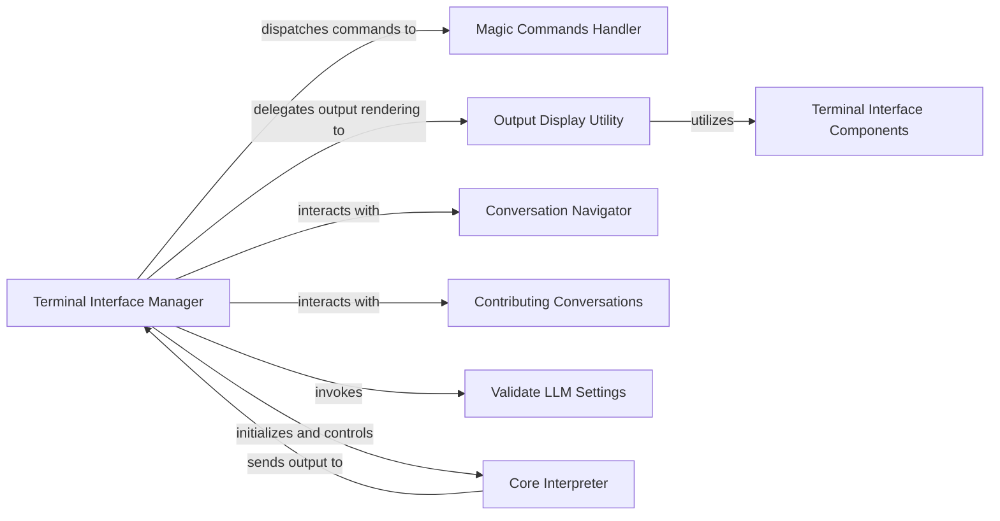

## Component Details

The Terminal User Interface subsystem is the user-facing layer of the application, responsible for all interactions within the command-line environment. It acts as the primary application entry point, displaying interpreter output, capturing user input, and providing a rich, formatted terminal experience.

### Terminal Interface Manager

This component is the central orchestrator and primary entry point for the terminal-based interaction. It initializes the interpreter, parses command-line arguments, manages the main interaction loop, and coordinates the lifecycle of the interpreter session. It acts as the hub, directing control and data flow between various terminal-related functionalities and the core interpreter. It is fundamental because it ties all other terminal components together, providing the main operational loop and overall control.

**Related Classes/Methods**:

- <a href="https://github.com/OpenInterpreter/open-interpreter/blob/master/interpreter/terminal_interface/start_terminal_interface.py#L18-L577" target="_blank" rel="noopener noreferrer">`interpreter.terminal_interface.start_terminal_interface` (18:577)</a>

### Magic Commands Handler

This component is dedicated to processing special "magic" commands (e.g., /help, /jupyter, /markdown) entered by the user. It extends the interpreter's functionality beyond standard code execution, enabling features like displaying help documentation, managing Jupyter environments, or handling specific output formats. It is fundamental for enhancing user interaction by providing shortcuts and extended functionalities not directly related to code execution.

**Related Classes/Methods**:

- <a href="https://github.com/OpenInterpreter/open-interpreter/blob/master/interpreter/terminal_interface/magic_commands.py#L1-L1" target="_blank" rel="noopener noreferrer">`interpreter.terminal_interface.magic_commands` (1:1)</a>

### Output Display Utility

This component standardizes and manages how various types of output from the interpreter (e.g., code, messages, file operations) are presented to the user in the command-line interface. It provides formatting and utility functions to ensure a consistent, readable, and visually appealing display. It is fundamental for a good user experience, ensuring that complex information is presented clearly and consistently.

**Related Classes/Methods**:

- <a href="https://github.com/OpenInterpreter/open-interpreter/blob/master/interpreter/terminal_interface/utils/display_output.py#L9-L33" target="_blank" rel="noopener noreferrer">`interpreter.terminal_interface.utils.display_output` (9:33)</a>

### Terminal Interface Components

This component defines the fundamental building blocks and visual elements used for displaying structured content within the terminal interface. It includes base classes and specific implementations for different types of output blocks, such as BaseBlock, CodeBlock, and MessageBlock, ensuring consistent rendering and extensibility for UI elements. It is fundamental as it provides the reusable visual primitives upon which the entire terminal output is constructed.

**Related Classes/Methods**:

- `interpreter.terminal_interface.components` (1:1)

### Conversation Navigator

This component provides functionality for navigating and displaying past conversations within the terminal interface. It allows users to review previous interactions, which is crucial for context, debugging, and continuing work across sessions. It is fundamental for user productivity and maintaining context across interactions.

**Related Classes/Methods**:

- <a href="https://github.com/OpenInterpreter/open-interpreter/blob/master/interpreter/terminal_interface/conversation_navigator.py#L1-L1" target="_blank" rel="noopener noreferrer">`interpreter.terminal_interface.conversation_navigator` (1:1)</a>

### Contributing Conversations

This component encapsulates the logic related to offering and managing the contribution of user conversations. This feature is likely used for improving the interpreter's capabilities or gathering data, and it integrates seamlessly with the main terminal interaction flow. It is fundamental for features that involve user data collection and system improvement.

**Related Classes/Methods**:

- <a href="https://github.com/OpenInterpreter/open-interpreter/blob/master/interpreter/terminal_interface/contributing_conversations.py#L1-L1" target="_blank" rel="noopener noreferrer">`interpreter.terminal_interface.contributing_conversations` (1:1)</a>

### Validate LLM Settings

This component is responsible for validating and potentially configuring the Language Model (LLM) settings that the interpreter will use. It ensures that the necessary LLM configurations are correctly set up before the main interaction loop begins, which is a critical pre-flight check for the application's core functionality. It is fundamental for ensuring the core AI capabilities are correctly configured before operation.

**Related Classes/Methods**:

- <a href="https://github.com/OpenInterpreter/open-interpreter/blob/master/interpreter/terminal_interface/validate_llm_settings.py#L1-L1" target="_blank" rel="noopener noreferrer">`interpreter.terminal_interface.validate_llm_settings` (1:1)</a>

### Core Interpreter

While not strictly part of the terminal_interface package, this is the central processing unit of the application. It is responsible for interpreting user input, executing code, and managing the overall conversational flow. The Terminal User Interface heavily relies on this component for actual interpretation and execution, acting as its primary input/output channel. It is fundamental as it represents the "brain" of the application, performing the actual interpretation and execution that the terminal interface facilitates.

**Related Classes/Methods**:

- <a href="https://github.com/OpenInterpreter/open-interpreter/blob/master/interpreter/core/core.py#L1-L1" target="_blank" rel="noopener noreferrer">`interpreter.core.core` (1:1)</a>

### [FAQ](https://github.com/CodeBoarding/GeneratedOnBoardings/tree/main?tab=readme-ov-file#faq)