```mermaid

graph LR

    Interpreter_Core["Interpreter Core"]

    Computer_Interaction_Layer["Computer Interaction Layer"]

    System_Tools_Language_Execution["System Tools & Language Execution"]

    Terminal_User_Interface["Terminal User Interface"]

    Application_Management["Application Management"]

    Interpreter_Core -- "interacts with" --> Computer_Interaction_Layer

    Interpreter_Core -- "communicates with" --> Terminal_User_Interface

    Computer_Interaction_Layer -- "utilizes" --> System_Tools_Language_Execution

    System_Tools_Language_Execution -- "provides capabilities to" --> Computer_Interaction_Layer

    Terminal_User_Interface -- "sends input to" --> Interpreter_Core

    Terminal_User_Interface -- "receives output from" --> Interpreter_Core

    Application_Management -- "initializes" --> Interpreter_Core

    Application_Management -- "configures" --> Terminal_User_Interface

    click Interpreter_Core href "https://github.com/OpenInterpreter/open-interpreter/blob/main/.codeboarding//Interpreter_Core.md" "Details"

    click Computer_Interaction_Layer href "https://github.com/OpenInterpreter/open-interpreter/blob/main/.codeboarding//Computer_Interaction_Layer.md" "Details"

    click System_Tools_Language_Execution href "https://github.com/OpenInterpreter/open-interpreter/blob/main/.codeboarding//System_Tools_Language_Execution.md" "Details"

    click Terminal_User_Interface href "https://github.com/OpenInterpreter/open-interpreter/blob/main/.codeboarding//Terminal_User_Interface.md" "Details"

    click Application_Management href "https://github.com/OpenInterpreter/open-interpreter/blob/main/.codeboarding//Application_Management.md" "Details"

```

## Component Details

This analysis consolidates the Control Flow Graph (CFG) and Source Analysis into a high-level architectural overview, identifying five core components and their interactions.

### Interpreter Core

The central processing unit of the application. It manages the overall conversation flow, interacts with the Language Model (LLM) to generate responses and actions, and orchestrates the execution of computer-related tasks. It also handles asynchronous operations and provides an API server for external interaction.

**Related Classes/Methods**:

- <a href="https://github.com/OpenInterpreter/open-interpreter/blob/master/interpreter/core/core.py#L1-L1" target="_blank" rel="noopener noreferrer">`interpreter.core.core.OpenInterpreter` (1:1)</a>

- <a href="https://github.com/OpenInterpreter/open-interpreter/blob/master/interpreter/core/async_core.py#L43-L275" target="_blank" rel="noopener noreferrer">`interpreter.core.async_core.AsyncInterpreter` (43:275)</a>

- <a href="https://github.com/OpenInterpreter/open-interpreter/blob/master/interpreter/core/async_core.py#L950-L1018" target="_blank" rel="noopener noreferrer">`interpreter.core.async_core.Server` (950:1018)</a>

- <a href="https://github.com/OpenInterpreter/open-interpreter/blob/master/interpreter/core/llm/llm.py#L37-L412" target="_blank" rel="noopener noreferrer">`interpreter.core.llm.llm.Llm` (37:412)</a>

- <a href="https://github.com/OpenInterpreter/open-interpreter/blob/master/interpreter/core/llm/run_tool_calling_llm.py#L100-L314" target="_blank" rel="noopener noreferrer">`interpreter.core.llm.run_tool_calling_llm.run_tool_calling_llm` (100:314)</a>

### Computer Interaction Layer

Provides a unified, high-level programmatic interface for the `Interpreter Core` to interact with the underlying computer system. It aggregates and manages various specialized computer tools, abstracting the complexities of direct system interaction (e.g., file system, browser, display, AI capabilities).

**Related Classes/Methods**:

- <a href="https://github.com/OpenInterpreter/open-interpreter/blob/master/interpreter/core/computer/computer.py#L21-L236" target="_blank" rel="noopener noreferrer">`interpreter.core.computer.computer.Computer` (21:236)</a>

- <a href="https://github.com/OpenInterpreter/open-interpreter/blob/master/interpreter/core/computer/ai/ai.py#L115-L191" target="_blank" rel="noopener noreferrer">`interpreter.core.computer.ai.ai.Ai` (115:191)</a>

- <a href="https://github.com/OpenInterpreter/open-interpreter/blob/master/interpreter/core/computer/browser/browser.py#L12-L160" target="_blank" rel="noopener noreferrer">`interpreter.core.computer.browser.browser.Browser` (12:160)</a>

- <a href="https://github.com/OpenInterpreter/open-interpreter/blob/master/interpreter/core/computer/calendar/calendar.py#L22-L301" target="_blank" rel="noopener noreferrer">`interpreter.core.computer.calendar.calendar.Calendar` (22:301)</a>

- <a href="https://github.com/OpenInterpreter/open-interpreter/blob/master/interpreter/core/computer/clipboard/clipboard.py#L6-L34" target="_blank" rel="noopener noreferrer">`interpreter.core.computer.clipboard.clipboard.Clipboard` (6:34)</a>

- <a href="https://github.com/OpenInterpreter/open-interpreter/blob/master/interpreter/core/computer/contacts/contacts.py#L5-L91" target="_blank" rel="noopener noreferrer">`interpreter.core.computer.contacts.contacts.Contacts` (5:91)</a>

- <a href="https://github.com/OpenInterpreter/open-interpreter/blob/master/interpreter/core/computer/display/display.py#L45-L338" target="_blank" rel="noopener noreferrer">`interpreter.core.computer.display.display.Display` (45:338)</a>

- <a href="https://github.com/OpenInterpreter/open-interpreter/blob/master/interpreter/core/computer/docs/docs.py#L8-L24" target="_blank" rel="noopener noreferrer">`interpreter.core.computer.docs.docs.Docs` (8:24)</a>

- <a href="https://github.com/OpenInterpreter/open-interpreter/blob/master/interpreter/core/computer/files/files.py#L7-L35" target="_blank" rel="noopener noreferrer">`interpreter.core.computer.files.files.Files` (7:35)</a>

- <a href="https://github.com/OpenInterpreter/open-interpreter/blob/master/interpreter/core/computer/keyboard/keyboard.py#L10-L130" target="_blank" rel="noopener noreferrer">`interpreter.core.computer.keyboard.keyboard.Keyboard` (10:130)</a>

- <a href="https://github.com/OpenInterpreter/open-interpreter/blob/master/interpreter/core/computer/mail/mail.py#L8-L160" target="_blank" rel="noopener noreferrer">`interpreter.core.computer.mail.mail.Mail` (8:160)</a>

- <a href="https://github.com/OpenInterpreter/open-interpreter/blob/master/interpreter/core/computer/mouse/mouse.py#L19-L271" target="_blank" rel="noopener noreferrer">`interpreter.core.computer.mouse.mouse.Mouse` (19:271)</a>

- <a href="https://github.com/OpenInterpreter/open-interpreter/blob/master/interpreter/core/computer/os/os.py#L4-L80" target="_blank" rel="noopener noreferrer">`interpreter.core.computer.os.os.Os` (4:80)</a>

- <a href="https://github.com/OpenInterpreter/open-interpreter/blob/master/interpreter/core/computer/sms/sms.py#L9-L122" target="_blank" rel="noopener noreferrer">`interpreter.core.computer.sms.sms.SMS` (9:122)</a>

- <a href="https://github.com/OpenInterpreter/open-interpreter/blob/master/interpreter/core/computer/terminal/terminal.py#L32-L206" target="_blank" rel="noopener noreferrer">`interpreter.core.computer.terminal.terminal.Terminal` (32:206)</a>

- <a href="https://github.com/OpenInterpreter/open-interpreter/blob/master/interpreter/core/computer/vision/vision.py#L14-L174" target="_blank" rel="noopener noreferrer">`interpreter.core.computer.vision.vision.Vision` (14:174)</a>

- <a href="https://github.com/OpenInterpreter/open-interpreter/blob/master/interpreter/computer_use/loop.py#L1-L1" target="_blank" rel="noopener noreferrer">`interpreter.computer_use.loop.main` (1:1)</a>

- <a href="https://github.com/OpenInterpreter/open-interpreter/blob/master/interpreter/computer_use/loop.py#L1-L1" target="_blank" rel="noopener noreferrer">`interpreter.computer_use.loop.sampling_loop` (1:1)</a>

### System Tools & Language Execution

Implements concrete system interaction capabilities (e.g., executing shell commands, performing file edits) and manages the execution of code in various programming and scripting languages within the terminal environment. These are the low-level "workers" used by the `Computer Interaction Layer`.

**Related Classes/Methods**:

- `interpreter.computer_use.tools.BashTool` (1:1)

- `interpreter.computer_use.tools.ComputerTool` (1:1)

- `interpreter.computer_use.tools.EditTool` (1:1)

- <a href="https://github.com/OpenInterpreter/open-interpreter/blob/master/interpreter/core/computer/terminal/languages/jupyter_language.py#L1-L1" target="_blank" rel="noopener noreferrer">`interpreter.core.computer.terminal.languages.JupyterLanguage` (1:1)</a>

- <a href="https://github.com/OpenInterpreter/open-interpreter/blob/master/interpreter/core/computer/terminal/languages/shell.py#L7-L35" target="_blank" rel="noopener noreferrer">`interpreter.core.computer.terminal.languages.Shell` (7:35)</a>

- `interpreter.core.computer.terminal.languages.PowerShell` (1:1)

- `interpreter.core.computer.terminal.languages.AppleScript` (1:1)

- `interpreter.core.computer.terminal.languages.JavaScript` (1:1)

- <a href="https://github.com/OpenInterpreter/open-interpreter/blob/master/interpreter/core/computer/terminal/languages/java.py#L9-L125" target="_blank" rel="noopener noreferrer">`interpreter.core.computer.terminal.languages.Java` (9:125)</a>

- <a href="https://github.com/OpenInterpreter/open-interpreter/blob/master/interpreter/core/computer/terminal/languages/subprocess_language.py#L11-L192" target="_blank" rel="noopener noreferrer">`interpreter.core.computer.terminal.languages.SubprocessLanguage` (11:192)</a>

- <a href="https://github.com/OpenInterpreter/open-interpreter/blob/master/interpreter/core/computer/terminal/languages/python.py#L10-L12" target="_blank" rel="noopener noreferrer">`interpreter.core.computer.terminal.languages.Python` (10:12)</a>

- `interpreter.core.computer.terminal.languages.HTML` (1:1)

- <a href="https://github.com/OpenInterpreter/open-interpreter/blob/master/interpreter/core/computer/terminal/languages/r.py#L5-L72" target="_blank" rel="noopener noreferrer">`interpreter.core.computer.terminal.languages.R` (5:72)</a>

- <a href="https://github.com/OpenInterpreter/open-interpreter/blob/master/interpreter/core/computer/terminal/languages/react.py#L42-L77" target="_blank" rel="noopener noreferrer">`interpreter.core.computer.terminal.languages.React` (42:77)</a>

- <a href="https://github.com/OpenInterpreter/open-interpreter/blob/master/interpreter/core/computer/terminal/languages/ruby.py#L5-L59" target="_blank" rel="noopener noreferrer">`interpreter.core.computer.terminal.languages.Ruby` (5:59)</a>

### Terminal User Interface

Responsible for all user-facing interactions in the command-line environment. It displays interpreter output, captures user input, and provides formatting and utility functions for a rich terminal experience. It also serves as the primary application entry point.

**Related Classes/Methods**:

- <a href="https://github.com/OpenInterpreter/open-interpreter/blob/master/interpreter/terminal_interface/start_terminal_interface.py#L607-L660" target="_blank" rel="noopener noreferrer">`interpreter.terminal_interface.start_terminal_interface.main` (607:660)</a>

- <a href="https://github.com/OpenInterpreter/open-interpreter/blob/master/interpreter/terminal_interface/start_terminal_interface.py#L18-L577" target="_blank" rel="noopener noreferrer">`interpreter.terminal_interface.start_terminal_interface.start_terminal_interface` (18:577)</a>

- <a href="https://github.com/OpenInterpreter/open-interpreter/blob/master/interpreter/terminal_interface/components/base_block.py#L4-L23" target="_blank" rel="noopener noreferrer">`interpreter.terminal_interface.components.BaseBlock` (4:23)</a>

- <a href="https://github.com/OpenInterpreter/open-interpreter/blob/master/interpreter/terminal_interface/components/code_block.py#L9-L97" target="_blank" rel="noopener noreferrer">`interpreter.terminal_interface.components.CodeBlock` (9:97)</a>

- <a href="https://github.com/OpenInterpreter/open-interpreter/blob/master/interpreter/terminal_interface/components/message_block.py#L9-L27" target="_blank" rel="noopener noreferrer">`interpreter.terminal_interface.components.MessageBlock` (9:27)</a>

- <a href="https://github.com/OpenInterpreter/open-interpreter/blob/master/interpreter/terminal_interface/utils/display_output.py#L9-L33" target="_blank" rel="noopener noreferrer">`interpreter.terminal_interface.utils.display_output.display_output` (9:33)</a>

- <a href="https://github.com/OpenInterpreter/open-interpreter/blob/master/interpreter/terminal_interface/utils/display_output.py#L1-L1" target="_blank" rel="noopener noreferrer">`interpreter.terminal_interface.utils.display_output.count_messages_tokens` (1:1)</a>

- <a href="https://github.com/OpenInterpreter/open-interpreter/blob/master/interpreter/terminal_interface/utils/display_output.py#L1-L1" target="_blank" rel="noopener noreferrer">`interpreter.terminal_interface.utils.display_output.export_to_markdown` (1:1)</a>

- <a href="https://github.com/OpenInterpreter/open-interpreter/blob/master/interpreter/terminal_interface/magic_commands.py#L145-L147" target="_blank" rel="noopener noreferrer">`interpreter.terminal_interface.magic_commands.default_handle` (145:147)</a>

- <a href="https://github.com/OpenInterpreter/open-interpreter/blob/master/interpreter/terminal_interface/magic_commands.py#L258-L296" target="_blank" rel="noopener noreferrer">`interpreter.terminal_interface.magic_commands.jupyter` (258:296)</a>

- <a href="https://github.com/OpenInterpreter/open-interpreter/blob/master/interpreter/terminal_interface/magic_commands.py#L299-L309" target="_blank" rel="noopener noreferrer">`interpreter.terminal_interface.magic_commands.markdown` (299:309)</a>

### Application Management

Manages the application's startup, shutdown, and persistent settings. This includes parsing command-line arguments, handling user profiles (loading, saving, migration), and managing conversation telemetry.

**Related Classes/Methods**:

- <a href="https://github.com/OpenInterpreter/open-interpreter/blob/master/interpreter/terminal_interface/contributing_conversations.py#L82-L92" target="_blank" rel="noopener noreferrer">`interpreter.terminal_interface.contributing_conversations.contribute_conversation_launch_logic` (82:92)</a>

- <a href="https://github.com/OpenInterpreter/open-interpreter/blob/master/interpreter/terminal_interface/contributing_conversations.py#L40-L56" target="_blank" rel="noopener noreferrer">`interpreter.terminal_interface.contributing_conversations.send_past_conversations` (40:56)</a>

- <a href="https://github.com/OpenInterpreter/open-interpreter/blob/master/interpreter/terminal_interface/profiles/profiles.py#L30-L63" target="_blank" rel="noopener noreferrer">`interpreter.terminal_interface.profiles.profiles.profile` (30:63)</a>

- <a href="https://github.com/OpenInterpreter/open-interpreter/blob/master/interpreter/terminal_interface/profiles/profiles.py#L144-L212" target="_blank" rel="noopener noreferrer">`interpreter.terminal_interface.profiles.profiles.apply_profile` (144:212)</a>

- <a href="https://github.com/OpenInterpreter/open-interpreter/blob/master/interpreter/terminal_interface/profiles/profiles.py#L215-L558" target="_blank" rel="noopener noreferrer">`interpreter.terminal_interface.profiles.profiles.migrate_profile` (215:558)</a>

### [FAQ](https://github.com/CodeBoarding/GeneratedOnBoardings/tree/main?tab=readme-ov-file#faq)